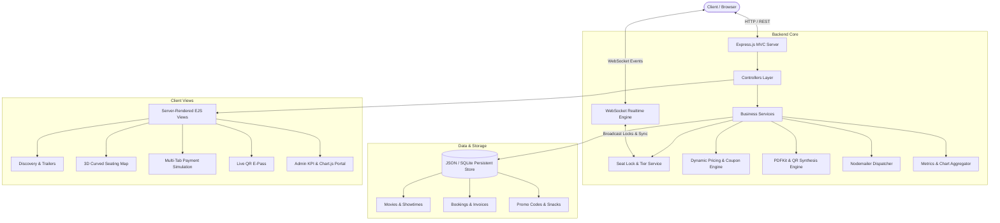

# 🎬 CineVerse Pro - Real-Time Cinema Booking & Concurrency Engine

[](https://nodejs.org)
[](https://expressjs.com)
[-cyan.svg)](https://github.com/websockets/ws)
[](https://pdfkit.org)
[](https://www.chartjs.org)
[](LICENSE)

An enterprise-grade, full-stack cinema ticket reservation and concurrency management platform. Built with a modular **Layered MVC Architecture**, real-time **WebSocket room broadcasting**, **5-minute TTL seat reservation locks**, **dynamic tiered pricing**, **F&B combo checkout**, **digital QR E-Passes & PDF ticket generation**, and an **Executive Admin Analytics Dashboard**.

---

## 🌟 Resume Highlights & Bullet Points

Use these quantifiable bullet points on your software engineering resume under **Projects / Full-Stack Experience**:

> **CineVerse Pro — Real-Time Cinema Ticketing & Concurrency Platform** *(Node.js, Express, WebSockets, PDFKit, Chart.js)*
> - **Real-Time Concurrency:** Engineered a room-based WebSocket synchronization engine with 5-minute TTL in-memory seat locks, eliminating double-booking race conditions across concurrent browser sessions.
> - **Dynamic Pricing & Promo Engine:** Developed a flexible coupon validation system (`CINEMA50`, `SUPER20`) with multi-tier seating calculations (VIP Recliner, Premium Club, Standard) and automated GST/convenience fee breakdown.
> - **Automated Ticketing Pipeline:** Built an automated ticket generation pipeline utilizing `PDFKit` and dynamic 2D `QRCode` encoding to render high-resolution printable tickets with instant gate verification.
> - **Executive Analytics & Reporting:** Designed a comprehensive Admin Analytics suite featuring `Chart.js` for daily revenue velocity, movie gross tracking, catalog CRUD operations, and streaming CSV data export.
> - **Modern Cyber-Cinema UI/UX:** Crafted a responsive dark-mode glassmorphic frontend with interactive curved screen seating maps, trailer modals, and simulated multi-channel checkout (Card, UPI QR, NetBanking).

---

## 🏗️ System Architecture



---

## 🚀 Key Features

### 1. 💺 Real-Time Seating & Concurrency Control
- **Multi-Tier Seat Layout:** VIP Recliners (Rows A-B: ₹450), Premium Club (Rows C-E: ₹300), Executive Standard (Rows F-H: ₹200), and Wheelchair accessible seating.
- **5-Minute TTL Lock:** Clicking seats triggers a temporary reservation lock. If another user views the same showtime, the seat turns orange (Locked) in real-time.
- **WebSocket Room Sync:** Clients automatically join isolated movie/showtime rooms (`join_show`), syncing live viewer count and seat statuses instantly.

### 2. 🍿 Gourmet Snacks & Coupon Engine
- **F&B In-Seat Delivery:** Add Gourmet Caramel Popcorn, Loaded Cheese Nachos, Cold Drinks, and Couple Combos with quantity steppers.
- **Promo Code Engine:**
  - `CINEMA50`: Flat ₹50 OFF on orders above ₹300.
  - `SUPER20`: 20% OFF up to ₹150 for CineVerse club members.
  - `STUDENT15`: 15% Student discount.
  - `POPCORNFREE`: Flat ₹100 snack discount on orders above ₹600.

### 3. 💳 Multi-Channel Checkout Simulation
- **Card Payment:** Animated Credit Card mockup reflecting cardholder name, formatted card number, CVV, and expiry date.
- **UPI QR Code:** Dynamic QR code generation for scanning via Google Pay, PhonePe, Paytm, and CRED.
- **NetBanking & Wallets:** Instant simulated bank clearance.

### 4. 🎫 High-Res PDF Ticket & Digital Web Pass
- **PDFKit Ticket Generator:** Generates professional A4 tickets with cinema branding, seat numbers, breakdown, rules, and encoded verification QR code.
- **Digital Web E-Pass (`/ticket/:id`):** Mobile-first wallet pass with holographic verified stamp, animated turnstile scanner, and print preview.

### 5. 📊 Executive Admin & Analytics Portal (`/admin`)
- **Key Metrics:** Total Gross Revenue, Tickets Booked, Average Order Value (AOV), Active Movies.
- **Interactive Charts:** Daily revenue velocity (Line chart) and revenue by movie (Bar chart) powered by Chart.js.
- **Movie CRUD & Showtime Scheduler:** Add new movies with poster lookup, adjust pricing, and schedule showtimes.
- **Streaming CSV Export:** Download comprehensive order records for accounting and reporting.

### 6. 👤 User Profile & Loyalty Rewards (`/dashboard`)
- **Loyalty Program:** Automatically awards 10 loyalty points per ₹100 spent.
- **One-Click Cancellation:** Allows cancellation prior to showtime, automatically releasing seats and logging refunds.

---

## 📡 RESTful API Documentation

| Method | Endpoint | Description |
| :--- | :--- | :--- |
| `GET` | `/api/v1/health` | Health check and server status |
| `GET` | `/api/v1/movies` | Fetch full movie catalog with metadata |
| `GET` | `/api/v1/movies/:id` | Fetch specific movie details and cast |
| `GET` | `/api/v1/shows?movieId=:id` | Fetch scheduled showtimes for a movie |
| `GET` | `/api/v1/shows/:showId/seats` | Fetch live seat map, occupancy %, and locked seats |
| `GET` | `/api/v1/coupons` | List all active promo discount codes |
| `GET` | `/api/v1/snacks` | List all available Food & Beverage items |
| `POST`| `/lock-seats` | Temporarily hold seats for 5 minutes |
| `POST`| `/apply-coupon` | Validate promo code and recalculate order total |
| `POST`| `/process-payment` | Finalize ticket reservation and generate booking ID |
| `GET` | `/download-ticket/:id` | Stream generated PDF ticket document |

---

## 💻 Tech Stack & Dependencies

- **Runtime:** Node.js (v18.x - v22.x)
- **Web Framework:** Express.js (v4.21+)
- **Real-Time Layer:** `ws` (WebSocket protocol v8.18)
- **Document Generation:** `pdfkit` (v0.17), `qrcode` (v1.5)
- **Templating Engine:** EJS (v3.1)
- **Visualizations:** Chart.js (v4.4)
- **Styling:** Custom Cyber-Cinema CSS Design System + Bootstrap 5.3 + FontAwesome 6.5
- **Communication:** Nodemailer with graceful fallback logger

---

## 🛠️ Quick Installation & Setup

1. **Clone the repository:**
   ```bash
   git clone https://github.com/YOUR_USERNAME/cinema-booking-pro.git
   cd cinema-booking-pro
   ```

2. **Install dependencies:**
   ```bash
   npm install
   ```

3. **Start the local development server:**
   ```bash
   npm start
   ```

4. **Open in Browser:**
   - **Customer Portal:** [http://localhost:3001](http://localhost:3001)
   - **Admin Analytics:** [http://localhost:3001/admin](http://localhost:3001/admin)
   - **User Bookings:** [http://localhost:3001/dashboard](http://localhost:3001/dashboard)
   - **REST API Health:** [http://localhost:3001/api/v1/health](http://localhost:3001/api/v1/health)

---

## 📄 License
This project is open-source and available under the [MIT License](LICENSE).